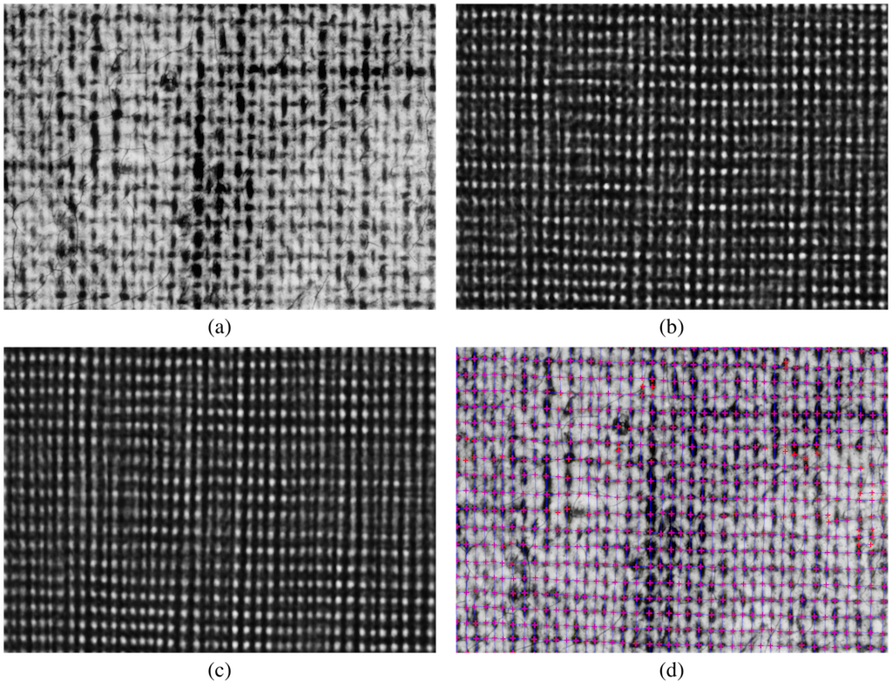
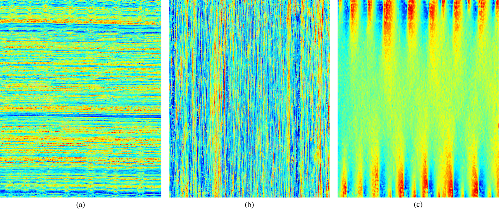

<section id="table-of-contents" class="toc">
  <header>
    <h3>Overview</h3>
  </header>

*  Auto generated table of contents
{:toc}

</section><!-- /#table-of-contents -->

Canvas analysis is an important tool in art-historical studies, as it can provide information on whether two paintings were made on canvas that originated from the same roll. Canvas analysis algorithms analyze radiographs of paintings to identify (ir)regularities in the spacings between the canvas threads. To reduce noise, current state-of-the-art algorithms do this by averaging the signal over a number of threads, which leads to information loss in the final measurements. 

This webpage presents the first  algorithm that is capable of performing _thread-level_ canvas analysis: the algorithm identifies each of the individual threads in the canvas radiograph, and directly measures between-distances and angles of the identified threads. We have performed two case studies to illustrate the potential merits of our thread-level canvas analysis algorithm, viz. on a small collection of paintings by Nicholas Poussin and on a small collection of paintings by Vincent Van Gogh.

 
The paper describing our thread-level canvas analysis algorithm will (hopefully) be available here soon:

* L.J.P. van der Maaten and R.G. Erdmann. **Automatic Thread-Level Canvas Analysis**. Under review at _IEEE Signal Processing Magazine_, 2015.

---

## Results

The images below provide an illustration of the results obtained using our thread-level canvas analysis algorithm. Right-click and click on _Open Image in New Tab_ to see a larger version of the images.

 
The image below shows: (a) a small patch of canvas taken from Poussin's [Triumph of Bacchus](https://www.google.com/culturalinstitute/asset-viewer/the-triumph-of-bacchus/AwHv86aFzSZnJA?hl=en); (b) the response of our thread crossing classifier on the patch of canvas; (c) the response of our model after incorporating the pictorial-structures model that exploit canvas regularity; and (d) the final thread-crossing detections and the identified neighbor relations between these detections. In the response images, a brighter color corresponds to a higher likelihood of a thread crossing being present in the canvas (according to our model). In the bottom-right figure, detected thread crossings are indicated by red crossings, whereas the blue lines indicate the detected neighbor relations.

 

 

To construct thread distance maps, distances that were measured between all neighboring thread crossings (that is, over all blue lines). At locations where blue lines are absent, the distances are interpolated from neighboring thread crossings. A similar approach was used to construct thread orientation maps.

 
The image below shows the results of thread-level canvas analysis on Poussin's [Triumph of Bacchus](https://www.google.com/culturalinstitute/asset-viewer/the-triumph-of-bacchus/AwHv86aFzSZnJA?hl=en). Specifically, the image shows: (a) spacing between warp threads, (b) spacing between the weft threads, and (c) orientation of the warp threads. In the spacing maps, a blue color corresponds to a small distance between threads, whilst a red color corresponds to a large distance between threads.

 

  

For the warp threads, thread spacings range between 1.2 and 1.9mm, whilst for weft threads, thread spacings range between 0.8 and 1.45mm. The warp orientation map shows strong cusping on the top and bottom, caused by the forces exerted on the canvas when it was attached to the wall and the ground layer was applied.

---

## Download

Matlab code implementing our thread-level canvas analysis algorithm will be made available here soon.

